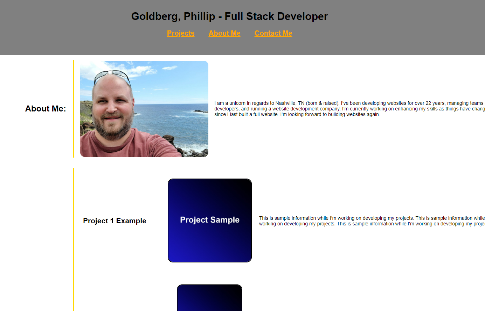

# Challenge 2 - GitHub Profile

## Description

Employer's want to view my work history and this page will display the history in an easy to follow format.

### User Story

AS AN employer
I WANT to view a potential employee's deployed portfolio of work samples
SO THAT I can review samples of their work and assess whether they're a good candidate for an open position

### Acceptance Criteria

GIVEN I need to sample a potential employee's previous work
WHEN I load their portfolio
THEN I am presented with the developer's name, a recent photo or avatar, and links to sections about them, their work, and how to contact them
WHEN I click one of the links in the navigation
THEN the UI scrolls to the corresponding section
WHEN I click on the link to the section about their work
THEN the UI scrolls to a section with titled images of the developer's applications
WHEN I am presented with the developer's first application
THEN that application's image should be larger in size than the others
WHEN I click on the images of the applications
THEN I am taken to that deployed application
WHEN I resize the page or view the site on various screens and devices
THEN I am presented with a responsive layout that adapts to my viewport

## Installation

Download the files from the repo and install on domain. Should work instantly.

## Usage

This is a responsive website used for GitHub profile to showcase my work history.

Link to view: [My Profile Site](https://pgold762.github.io/mod2-profile/)

Screenshot of website: 

## Credits

Used the following Reset.CSS file from [Digital Ocean](https://www.digitalocean.com/community/tutorials/css-minimal-css-reset)

Used the following as a guide [CSS-Tricks](https://css-tricks.com/snippets/css/a-guide-to-flexbox/)

Received assistance from AskBCS user ssavage2 with creating a wrapper div to push everything center into the page on desktop.

Received assistance from Tutor Andrew Tirpok who helped me with understanding the pieces I was missing with laying out my site using Flex.

Used the following for guidance on wrapping flex items: [mdn web docs](https://developer.mozilla.org/en-US/docs/Web/CSS/CSS_flexible_box_layout/Mastering_wrapping_of_flex_items)

Used the following for guidance on fixing the browser not recognizing media queries: [StackOverflow](https://stackoverflow.com/questions/17344339/media-query-not-working-in-mobile-works-fine-in-chrome)

Worked with Instructor John Brown and fixed the body layout issues

## License

MIT License
